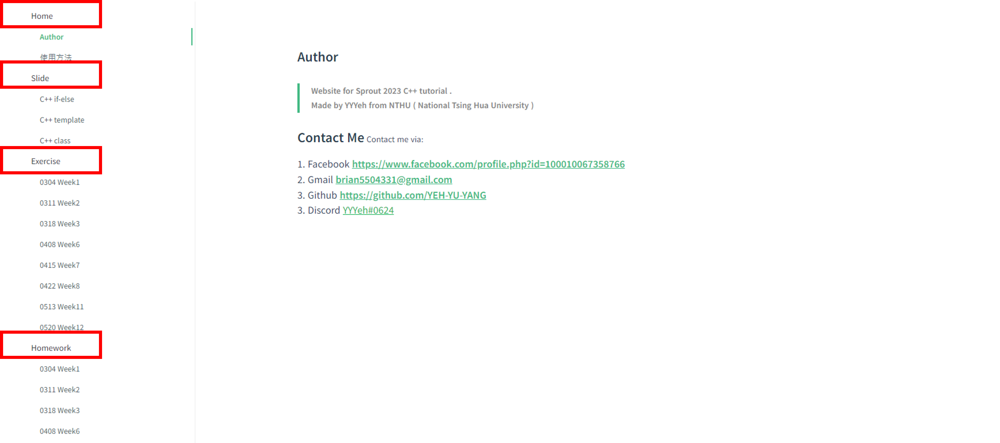
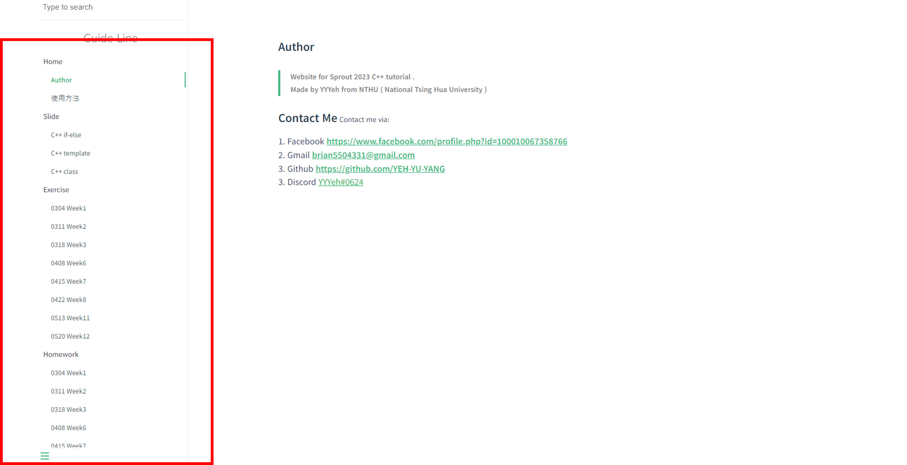
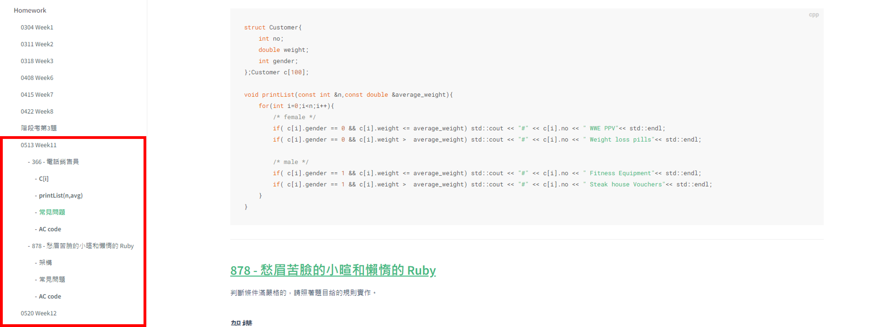
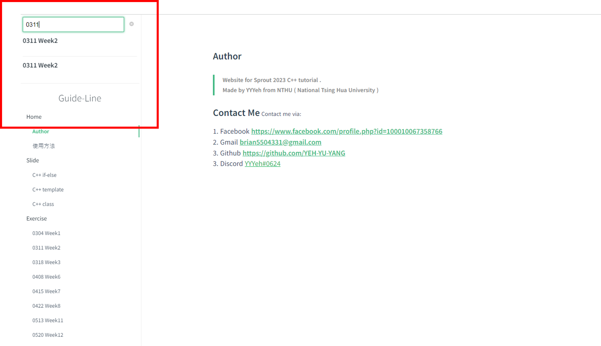
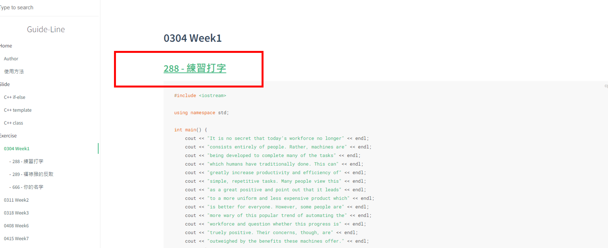

# 使用方法

## 分類

總共有4個欄位，分別是:
* **1.Home 主頁**
* **2.Slide 教材和影片**
* **3.Exercise 上課練習題**
* **4.Homework 作業題**

---

## 左側欄位.

點選左側欄位，可以跳轉至對應的頁面內容

---

## 左側多項欄位
如果當週是我當作業講解的助教，會有比較細的欄位，可以快速跳到那些重點喔 ! 

---

## 左上搜尋欄

左上的搜尋欄，可以快速搜索到你要的內容

---

## 綠色底線文字
綠色底線的文字可以點擊 ! 她會帶你到對應的網頁喔 !!

---

